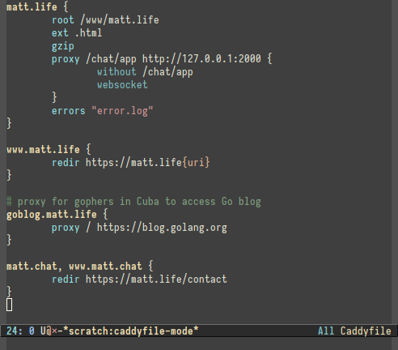

# Emacs Caddyfile Mode [![Travis CI Build Status][travis-badge]][travis-link]

caddyfile-mode is a [Emacs][] major mode for editing [Caddy][] configuration
files, a.k.a Caddyfiles.

caddyfile-mode is free software, licensed under the GNU GPL, version 3 or later.



## Installation

### MELPA

The simplest way to install `caddyfile-mode` is to install the package from
[MELPA][] using `package.el`. First configure `package.el` and the MELPA
repository in your Emacs configuration file:

```elisp
(require 'package)
(add-to-list 'package-archives '("melpa" . "https://melpa.org/packages/"))
(package-initialize)
```

Then install `caddyfile-mode`: <kbd>M-x package-install RET caddyfile-mode
RET</kbd>.

Alternatively, if you manage loading packages with [use-package][]
then you can automatically install and configure `caddyfile-mode` by
adding a declaration such as this one to your init file (as an
example; adjust settings as desired):

```elisp
(use-package caddyfile-mode
  :ensure t
  :mode (("Caddyfile\\'" . caddyfile-mode)
         ("caddy\\.conf\\'" . caddyfile-mode)))
```

### Direct download

You can manually download and install caddyfile-mode. First, download the
[latest version][] and save the file where Emacs can find it (i.e., a directory
in your `load-path`). You can then configure `caddyfile-mode` load automatically
by adding the following to your init file:

```elisp
(autoload caddyfile-mode "caddyfile-mode"
   "Major mode for editing Caddyfiles" t)
(add-to-list 'auto-mode-alist '("Caddyfile\\'" . caddyfile-mode))
(add-to-list 'auto-mode-alist '("caddy\\.conf\\'" . caddyfile-mode))
```

### Development version

To follow or contribute to caddyfile--mode development, you can browse or clone
the Git repository [on GitHub][repo]:

```
git clone https://github.com/Schnouki/caddyfile-mode.git
```

If you clone the repository directly, then make sure that Emacs can
find it by adding the following line to your startup file:

```elisp
(add-to-list 'load-path "/path/to/caddyfile-mode/repository")
```

## Customization

There are a few things that can be customized, either with <kbd>M-x
customize-mode</kbd> or from your configuration file:

* `caddyfile-comment-face`: the face used for comments
* `caddyfile-label-face`: the face used for block labels
* `caddyfile-directive-face`: the face used for configuration directives
* `caddyfile-subdirective-face`: the face used for subdirectives
* `caddyfile-variable-face`: the face used for variables (`{path}`, etc.)

Other than that, you may be interested in changing the default value for
`tab-with` and `indent-tabs-mode` in your `caddyfile-mode` buffers:

```elisp
(defun my-caddyfile-hook ()
  (setq-local tab-width 4)  ;; Default: 8
  (setq-local indent-tabs-mode nil))  ;; Default: t
(add-hook 'caddyfile-mode-hook #'my-caddyfile-hook)
```

## Bugs

caddyfile-mode is developed and tested primarily for compatibility with GNU
Emacs 25 and later. If you find any bugs in caddyfile-mode, please open a ticket on the [issue tracker][].


[Caddy]: https://caddyserver.com/
[Emacs]: https://www.gnu.org/software/emacs/
[MELPA]: http://melpa.org/
[issue tracker]: https://github.com/Schnouki/caddyfile-mode/issues
[latest version]: https://github.com/Schnouki/caddyfile-mode/blob/master/caddyfile-mode.el
[repo]: https://github.com/Schnouki/caddyfile-mode
[travis-badge]: https://api.travis-ci.com/Schnouki/caddyfile-mode.svg?branch=master
[travis-link]: https://travis-ci.com/Schnouki/caddyfile-mode
[use-package]: https://github.com/jwiegley/use-package
